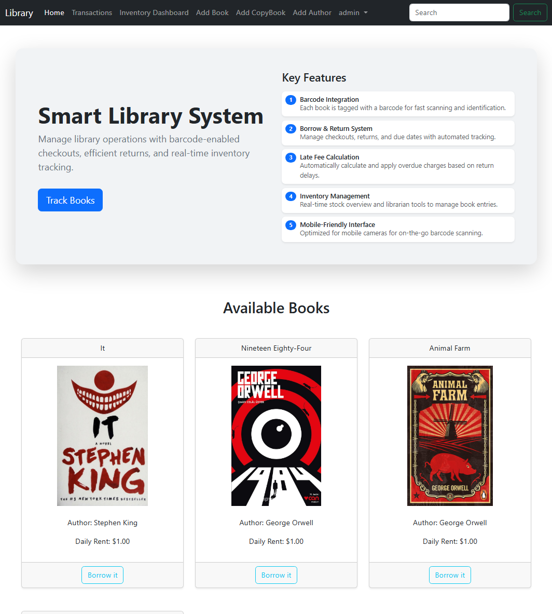

#  Smart Library Management System

[](https://github.com/AsHkAn-Django/library-management/actions)


> **Status:** Production Ready

A full-stack inventory management solution that bridges physical hardware with digital systems. This application streamlines library operations through **barcode scanner integration**, automated penalty calculations, and server-side PDF generation for ID cards and reports.

It is fully containerized with **Docker** and deployed via a **CI/CD pipeline**, solving complex OS-level dependencies for rendering engines on Linux servers.

<p align="center">

</p>

---

## Tech Stack

Designed for reliability and real-time hardware interaction.

**Backend & Core**
* **Python 3.11 & Django 5:** Robust backend logic and ORM.
* **PostgreSQL:** Relational database for handling complex inventory relationships.
* **WeasyPrint:** Integrated within Docker for pixel-perfect PDF generation.

**Infrastructure & DevOps**
* **Docker & Docker Compose:** Isolates the app and handles heavy dependencies (Cairo/Pango for PDFs).
* **Nginx & Gunicorn:** Production-grade web serving and reverse proxy.
* **GitHub Actions:** Automated CI/CD pipeline for VPS deployment.

**Frontend & Hardware**
* **Bootstrap 5 & JavaScript:** Responsive UI optimized for mobile viewports.
* **Hardware Integration:** Compatible with standard USB/Bluetooth barcode scanners.

---

## Key Features

### 1. Hardware & Barcode Integration
Each book and user ID is tagged with a unique barcode. The system integrates with physical scanners to allow for rapid, error-free identification during check-in/check-out workflows.

### 2. Automated Borrow & Return
Streamlined lifecycle management for assets. The system tracks due dates automatically and updates inventory status in real-time as items are scanned.

### 3. Smart Late Fee Calculation
Includes an algorithmic penalty system that automatically calculates overdue charges based on the return delay, enforcing library policies without manual intervention.

### 4. PDF Report Generation
Solves the challenge of generating printable assets on the web. Using **WeasyPrint**, the system renders high-quality PDF reports and Member ID Cards directly from the server.

### 5. Mobile-First Design
The interface is optimized for mobile devices, allowing librarians to perform inventory checks and barcode scanning on the go using mobile cameras or portable scanners.

---

## Technical Challenges Solved

**Problem:** Generating PDFs (Member IDs, Reports) on a headless Linux server is difficult due to missing system-level dependencies (Cairo, Pango, GDK-Pixbuf).

**Solution:**
I engineered a custom **Docker** image that installs these low-level binaries at the OS level before installing Python requirements. This ensures consistent, pixel-perfect PDF rendering across Dev, Staging, and Production environments, eliminating the "it works on my machine" problem.

---

## Local Development

Since the project is Dockerized, you do not need to install system dependencies manually.

### 1. Clone the repo
```bash
git clone [https://github.com/AsHkAn-Django/library-management.git](https://github.com/AsHkAn-Django/library-management.git)
cd library-management
```

2. Create environment variables
Create a .env file in the root directory:

```Ini

DEBUG=1
SECRET_KEY=your-secret-key
DB_NAME=library_db
DB_USER=postgres
DB_PASSWORD=postgres
DB_HOST=db
ALLOWED_HOSTS=localhost,127.0.0.1
```
3. Build & Run

```Bash

docker compose up --build
```

The application will be available at http://localhost:8000.

---

## Deployment Pipeline
This project uses a Continuous Deployment (CD) pipeline via GitHub Actions:

1. Push to Main: Triggers the workflow.

2. SSH Connection: Connects securely to the Production VPS.

3. Pull & Build: Fetches the latest code and rebuilds Docker containers (ensuring PDF dependencies are updated).

4. Database Migration: Automatically applies new Django migrations.

5. Static Files: Collects static assets for Nginx to serve.
---

## Contact & Portfolio
Ashkan Ahrari - Backend & Deployment Specialist

Portfolio: [codewithashkan.com](https://codewithashkan.com/)

GitHub: [AsHkAn-Django](https://github.com/AsHkAn-Django)

LinkedIn: [Ashkan Ahrari](https://www.linkedin.com/in/ashkan-ahrari/)


---
⭐️ If you find this project useful, please give it a star!